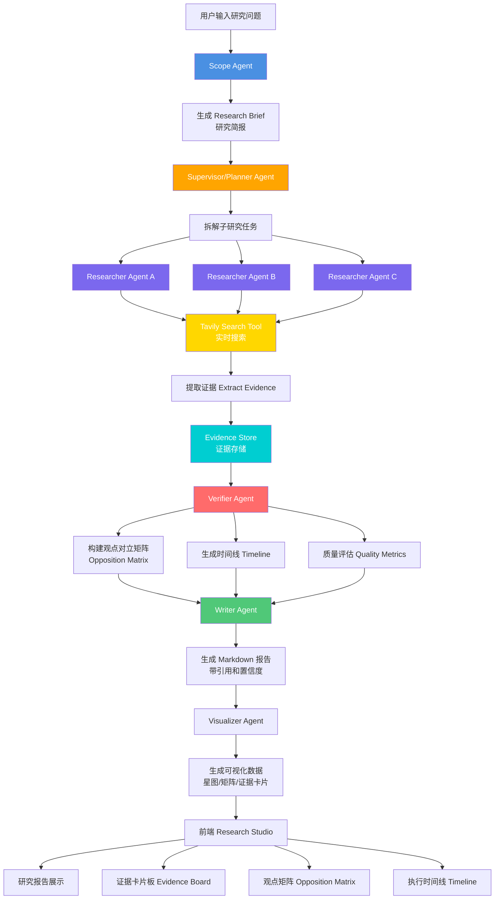
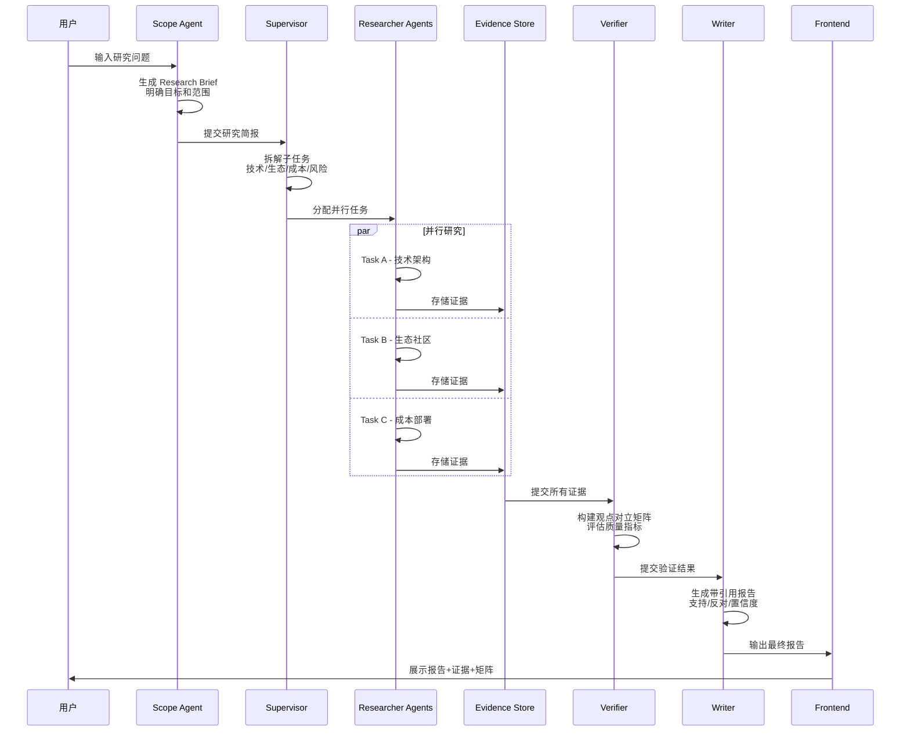
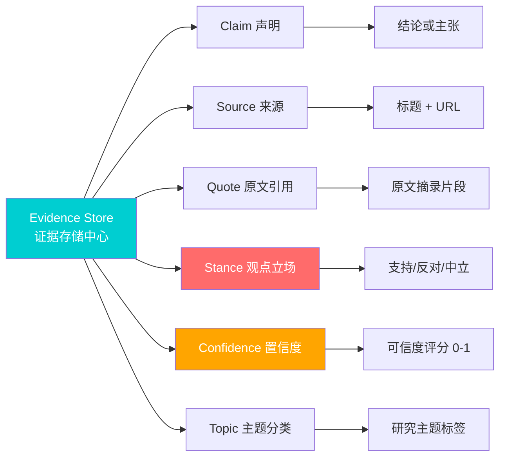
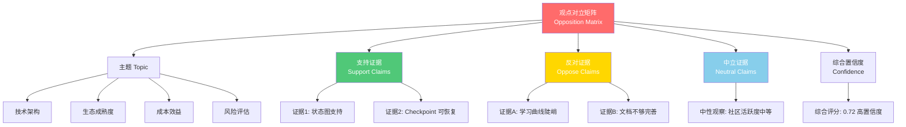
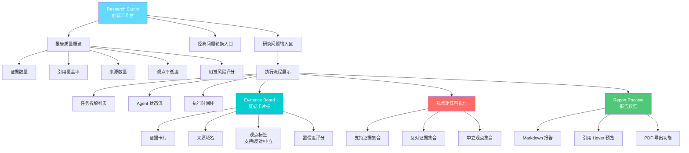
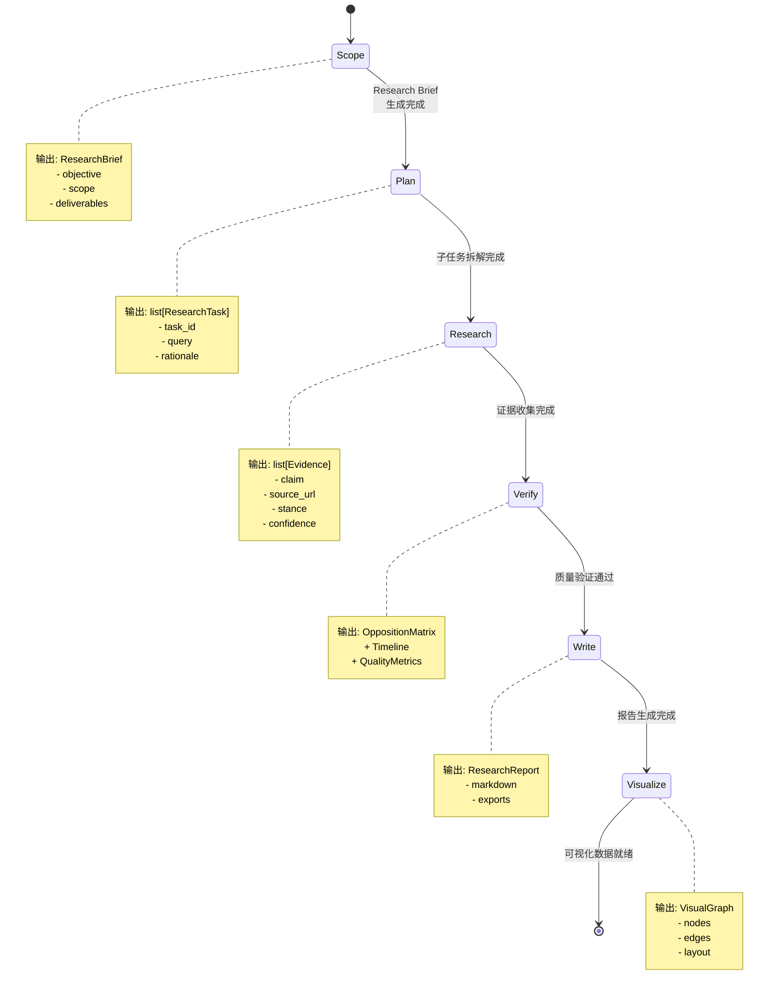
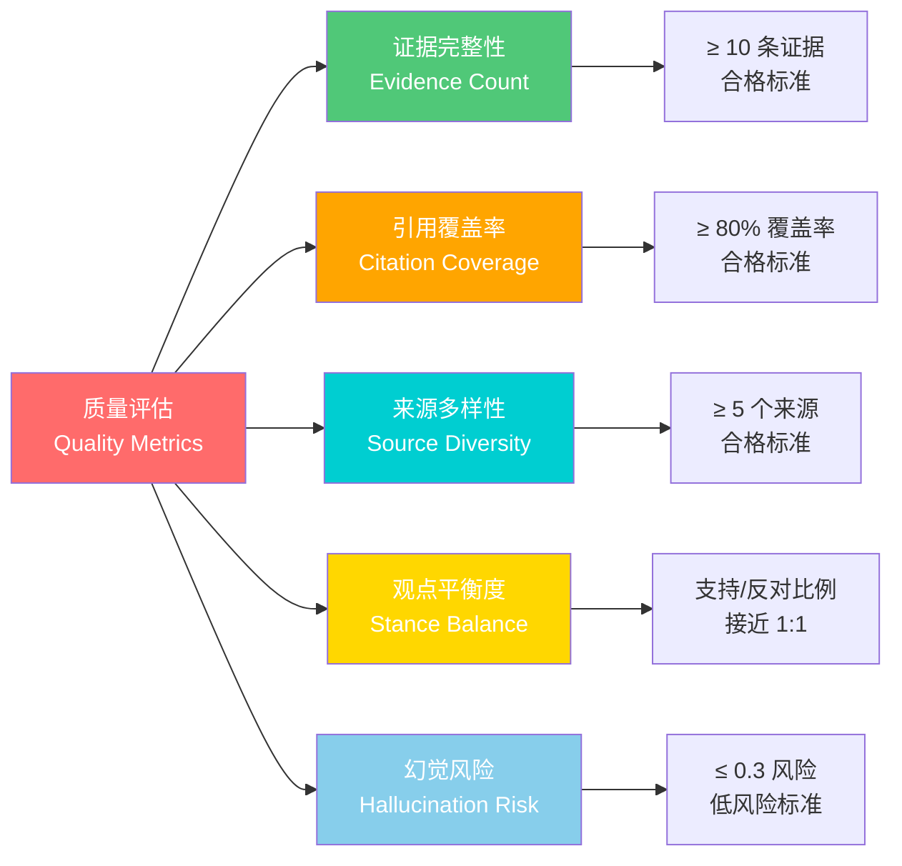

# Deep Research Agent

中文优先的 Deep Research Agent，面向复杂研究任务，强调可解释、多 Agent 协作、证据追溯、观点对立矩阵和高质量报告生成。

## 系统架构

### LangGraph 工作流编排



### 多 Agent 协作流程



### Evidence Store 数据模型



**Evidence 数据结构**：
```json
{
  "id": "evidence-001",
  "task_id": "task-architecture",
  "claim": "LangGraph 支持状态图和检查点恢复",
  "source_title": "LangGraph Official Documentation",
  "source_url": "https://github.com/langchain-ai/langgraph",
  "quote": "Build resilient agents with stateful workflows",
  "stance": "support",
  "confidence": 0.84,
  "topic": "architecture"
}
```

### 观点对立矩阵



**矩阵示例**：
| 主题 | 支持证据 | 反对证据 | 置信度 |
|------|---------|---------|--------|
| LangGraph 适合复杂工作流 | 状态图、checkpoint、human-in-loop | 学习曲线更高 | 高 (0.72) |
| AutoGen 社区活跃 | Microsoft 支持、多 Agent 协作 | API 变化频繁 | 中 (0.65) |
| CrewAI 易于上手 | 简洁 API、角色定义清晰 | 企业级能力待验证 | 中 (0.58) |

### 前端 Research Studio 架构



### 核心组件说明

#### 🔍 Scope Agent（范围定义）
**职责**：澄清用户模糊问题，生成研究简报

**输出**：
- 研究背景
- 明确目标
- 研究范围（包含项/排除项）
- 交付格式
- 成功标准

**示例**：
```
输入: "研究 LangGraph 和 AutoGen 哪个更好"

输出: 
Research Brief {
  objective: "对比 LangGraph、AutoGen、CrewAI 在企业级多 Agent 系统中的适用性",
  scope: ["技术架构", "生态成熟度", "成本部署", "风险限制"],
  deliverables: ["选型报告", "评分矩阵", "风险分析"],
  success_criteria: ["至少 10 个引用来源", "包含反对观点"]
}
```

#### 📋 Supervisor（任务拆解）
**职责**：将研究问题拆解为可并行子任务

**拆解策略**：
- 按主题维度拆分（技术/生态/成本/风险）
- 按对比对象拆分（LangGraph/AutoGen/CrewAI）
- 按时间维度拆分（现状/趋势/历史）

**输出**：3-5 个并行 ResearchTask

#### 🔬 Researcher Agent（证据收集）
**职责**：执行搜索并提取结构化证据

**能力**：
- Tavily Live Search 实时搜索
- Mock Search 离线测试
- Evidence Extraction 证据抽取
- Stance Classification 观点分类
- Confidence Scoring 置信度评估

**工具权限**：
- `search(query, max_results=3)`
- `extract_evidence(task, search_results)`
- `classify_stance(claim, context)`
- `calculate_confidence(source, quote)`

#### ✅ Verifier Agent（质量验证）
**职责**：检查证据完整性、观点对立和引用质量

**能力**：
- Opposition Matrix 构建（支持/反对/中立）
- Timeline 生成（研究步骤时间线）
- Quality Metrics 计算：
  - Evidence Count（证据数量）
  - Citation Coverage（引用覆盖率）
  - Source Diversity（来源多样性）
  - Stance Balance（观点平衡度）
  - Hallucination Risk（幻觉风险）

#### 📝 Writer Agent（报告生成）
**职责**：生成带引用、带置信度的 Markdown 报告

**输出结构**：
```markdown
# 研究报告标题

## 直接答案
简明结论 [引用1]

## 执行方案
分步骤建议 [引用2, 引用3]

## 指标验收
量化验收标准 [引用4]

## 落地计划
实施时间表 [引用5]

## 证据引用
[1] Source A - 证据原文
[2] Source B - 证据原文
```

#### 🎨 Visualizer Agent（可视化生成）
**职责**：生成前端展示所需的 JSON 数据

**输出**：
- Visual Graph（星图/知识图谱）
- Evidence Cards（证据卡片列表）
- Opposition Matrix（观点矩阵）
- Timeline（时间线数据）

### LangGraph 状态流转



### 质量评估指标体系



**评估脚本输出示例**：
```powershell
python scripts/evaluate_demo.py

输出:
- 证据数量: 28 条
- 引用覆盖率: 92%
- 来源数量: 12 个独立来源
- 观点平衡度: 支持 14 条 / 反对 8 条 / 中立 6 条
- 幻觉风险评分: 0.18 (低风险)
```

This project imports `medical.json` into Neo4j as a medical knowledge graph.

## 当前能力

- LangGraph：用 `StateGraph` 编排 Scope -> Plan -> Research -> Verify -> Write -> Visualize
- Scope Agent：把用户问题转成中文 research brief
- Supervisor：拆解子研究任务
- Researcher：调用 Tavily live search 并抽取证据，保留 mock search 供测试和离线开发
- Evidence Store：保留 claim、source、quote、stance、confidence
- Verifier：生成观点对立矩阵和质量指标
- Writer：生成带引用的中文 Markdown 报告，并输出直接答案、执行方案、指标验收和落地计划
- LLM adapter：支持 OpenAI-compatible 模型，未配置时规则兜底
- FastAPI：提供 `/api/research`、`/api/research/events`、`/api/export/markdown`
- React：研究生成器、经典问题轮换入口、证据板、观点矩阵、时间线、Report Studio、新页面报告预览和 PDF 导出

## 运行后端

```powershell
python -m uvicorn app.main:app --app-dir backend --reload --host 127.0.0.1 --port 8000
```

## 运行前端

```powershell
cd frontend
npm install
npm run dev
```

打开：

```text
http://127.0.0.1:5173
```

## 环境变量

复制 `.env.example` 为 `.env`，填入自己的 key。

```powershell
Copy-Item .env.example .env
```

当前前端默认使用 Live Tavily search，因此演示真实研究前需要配置 `TAVILY_API_KEY`。后端仍保留 `use_mock_search` 参数，主要用于自动化测试和离线开发。

如果配置 `OPENAI_API_KEY`、`OPENAI_BASE_URL`、`MODEL_NAME`，Writer 会尝试使用 OpenAI-compatible 模型；未配置时使用规则化中文兜底，保证演示链路可运行。

配置或修改 `.env` 后需要重启后端服务，否则当前运行中的进程读不到新的环境变量。

真实搜索最小配置：

```env
TAVILY_API_KEY=your_tavily_api_key
```

如果真实模式提示 `TAVILY_API_KEY is required for live Tavily search.`，说明后端进程没有读到 key。检查 `.env` 是否位于项目根目录，并重启：

```powershell
python -m uvicorn app.main:app --app-dir backend --reload --host 127.0.0.1 --port 8000
```

## 测试

```powershell
python -m pytest backend/tests
cd frontend
npm run build
```

## 评估 Demo

```powershell
python scripts/evaluate_demo.py
```

该脚本会跑 `examples/demo_tasks.json` 中的中文研究任务，并输出：

- 证据数量
- 引用覆盖率
- 来源数量
- 观点平衡度
- 幻觉风险评分

## 面试材料

- 设计文档：`docs/deep-research-agent-design.md`
- 面试讲解稿：`docs/interview-script.md`
- 项目现状报告：`docs/project-status-report.md`
- 演示任务：`examples/demo_tasks.json`

## Open Deep Research 复用策略

本项目选择 A + 少量 B：

- 原创实现核心数据模型、Evidence Store、Verifier、Research Studio 前端
- 借鉴 Open Deep Research 的 Scope / Research / Write 分阶段思想
- 后续如引入 Open Deep Research 代码，需要保留 MIT License 和来源说明
