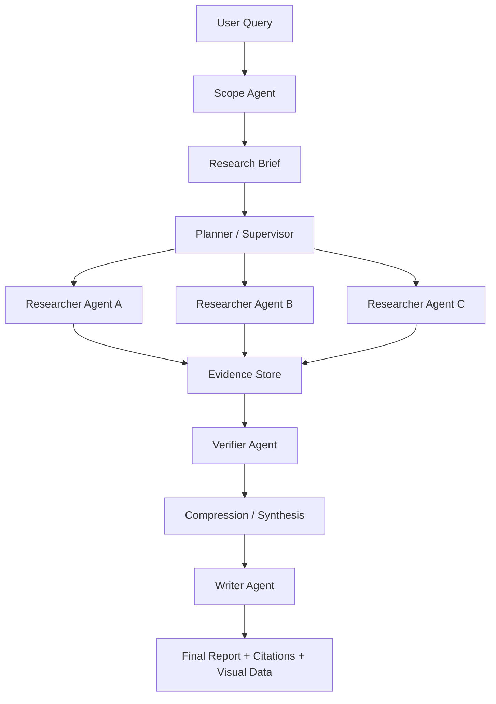

# Deep Research Agent 设计文档

## 1. 项目定位

这个项目不做普通的“联网搜索总结器”，而是做一个可解释、可追溯、可评估的研究型 Agent 工作台。

一句话定位：

> 一个面向复杂问题的 Deep Research Agent：能把模糊问题澄清成研究任务，自动拆解子问题，调度多个研究员 Agent 并行检索，构建证据图谱，最后生成带引用、带置信度、带反方观点的深度报告。

适合面试表达的关键词：
- LangGraph 状态机
- Multi-Agent Supervisor
- Tool Calling
- Evidence Grounding
- Report Synthesis
- Citation Traceability
- Evaluation Harness
- Research Studio UI

## 2. 为什么比旅行 Agent 更有价值

旅行 Agent 的问题是业务价值容易被质疑：订机票、查酒店、做行程都已经有成熟产品，面试时容易变成普通 API 编排。

Deep Research Agent 更适合展示工程能力：
- 任务复杂：需要澄清、规划、并行检索、压缩、归纳、写作。
- 架构复杂：天然适合 LangGraph 和多 Agent。
- 质量可控：可以设计引用、证据、反证、评估。
- 可演示性强：研究过程可以做成动态图、时间线、证据卡片。
- 延展空间大：能扩展到行业研究、竞品分析、政策分析、论文调研、投资尽调。

## 3. 核心使用场景

### 场景 A：技术选型研究
输入：
> 帮我研究 LangGraph、AutoGen、CrewAI 哪个更适合做企业级多 Agent 系统。

输出：
- 选型报告
- 评分矩阵
- 架构差异
- 生态成熟度
- 风险和推荐结论
- 引用来源

### 场景 B：竞品/行业研究
输入：
> 分析 2026 年 AI 编程 Agent 的主流产品和商业化趋势。

输出：
- 市场结构
- 核心玩家
- 商业模式
- 技术路线
- 机会点
- 风险判断

### 场景 C：论文/政策研究
输入：
> 研究 RAG 评估方法的发展脉络，并给出工程落地建议。

输出：
- 时间线
- 方法分类
- 关键论文
- 争议点
- 落地建议

## 4. 产品亮点

### 亮点 1：Research Brief 自动生成

用户的问题往往是模糊的，Agent 不直接搜索，而是先生成研究简报：
- 背景
- 目标
- 范围
- 排除项
- 输出格式
- 成功标准

这样面试时可以强调：我没有把 LLM 当聊天机器人，而是把它当任务规划器。

### 亮点 2：Supervisor 拆解任务

Supervisor 将研究问题拆成多个可并行子任务，例如：
- 技术架构
- 生态和社区
- 成本和部署
- 风险与限制
- 真实案例

每个子任务交给独立 Researcher Agent，避免上下文互相污染。

### 亮点 3：Evidence Store

所有搜索结果和关键结论都进入证据库：

```json
{
  "claim": "LangGraph 更适合构建有状态、可恢复的 Agent 工作流",
  "source_url": "https://github.com/langchain-ai/langgraph",
  "quote": "Build resilient agents",
  "confidence": 0.84,
  "stance": "support",
  "topic": "architecture"
}
```

最终报告不是凭空生成，而是从 Evidence Store 汇总。

### 亮点 4：观点对立矩阵

对每个关键结论，系统尝试寻找支持和反对证据：

| 结论 | 支持证据 | 反对证据 | 置信度 |
|------|---------|---------|--------|
| LangGraph 适合复杂工作流 | 状态图、checkpoint、human-in-loop | 学习曲线更高 | 高 |

这个比普通 Research Agent 更像“研究”，而不是“赞同用户”。

### 亮点 5：Research Studio 前端工作台

前端不是聊天页，而是 Research Mission Control：
- 顶部是用户研究目标和经典问题入口
- 旁边展示报告准备度、来源数、证据数和风险
- 下方展示任务拆解、证据卡片、观点矩阵和时间线
- 鼠标移动有轻量流体光轨效果，增强第一眼记忆点
- 生成的报告可以在新页面打开，并支持浏览器打印导出 PDF

这会成为项目的第一眼记忆点。

## 5. Agent 架构



### Agent 角色

| Agent | 职责 |
|------|------|
| Scope Agent | 澄清问题，生成 research brief |
| Supervisor | 拆解研究计划，调度子 Agent |
| Researcher | 搜索、阅读、提取证据 |
| Verifier | 检查引用、冲突、缺失信息 |
| Writer | 统一生成最终报告 |
| Visualizer | 输出前端星图、时间线、矩阵所需 JSON |

## 6. LangGraph 状态设计

核心状态：

```python
class ResearchState(TypedDict):
    user_query: str
    brief: ResearchBrief
    plan: list[ResearchTask]
    active_tasks: list[str]
    findings: list[Finding]
    evidence: list[Evidence]
    gaps: list[ResearchGap]
    report: str
    visual_graph: dict
```

关键节点：
- `scope_question`
- `generate_brief`
- `plan_research`
- `dispatch_researchers`
- `collect_findings`
- `verify_evidence`
- `compress_context`
- `write_report`
- `build_visual_graph`

## 7. 可复用 Open Deep Research 的部分

Open Deep Research 是 MIT 许可，建议复用时保留 LICENSE 和来源说明。

建议复用或借鉴：
- LangGraph 主流程组织方式
- Scope / Research / Write 三阶段思想
- Supervisor + 子 Agent 的研究模式
- 搜索工具抽象
- MCP 工具接入思路
- 内容压缩节点
- 评估 benchmark 的组织方式

不建议直接照搬：
- 默认前端体验
- 报告结构
- 提示词全部原样复制
- 项目命名和文档叙事

本项目应该形成自己的差异：
- Evidence Store
- 观点对立矩阵
- Research Studio 前端工作台
- 面向中文研究和面试演示的模板
- 更强的报告可追溯 UI

## 8. 技术栈建议

### 后端
- Python 3.11+
- LangGraph
- LangChain
- FastAPI
- Pydantic
- SQLite/Postgres
- Redis 可选，用于任务状态

### 搜索与抓取
- MVP：Tavily 或 SerpAPI
- 增强：Firecrawl、Playwright 抓取
- 可选：MCP 工具接入

### 模型
- 默认兼容 OpenAI-compatible API
- Scope/Compression：便宜快速模型
- Research/Writer：强模型
- 可做模型配置页，展示工程完整性

### 前端
- Next.js 或 Vite + React
- React 可视化组件
- Tailwind CSS
- shadcn/ui
- Zustand 或 TanStack Query

## 9. 前端页面规划

### 页面 1：Research Console
- 左侧：输入研究问题、研究范围、深度等级、输出格式
- 中央：经典问题入口、运行流程和报告质量概览
- 右侧：Agent 状态流和任务列表

### 页面 2：Evidence Board
- 证据卡片
- 来源域名
- 支持/反对/中立标签
- 可信度
- 原文摘录

### 页面 3：Report Studio
- 最终报告
- 引用 hover 预览
- 一键导出 Markdown/PDF
- 章节级溯源

### 页面 4：Evaluation Dashboard
- 报告完整度
- 引用覆盖率
- 冲突发现数
- 幻觉风险评分
- 成本和 token 使用量

## 10. MVP 范围

第一版只做这些：
1. 用户输入研究主题
2. 生成 research brief
3. 自动拆解 3-5 个子任务
4. 每个子任务执行搜索
5. 提取证据并保存
6. 生成带引用报告
7. 前端展示星图、任务进度、报告

暂不做：
- 用户登录
- 复杂权限
- 多人协作
- 长期记忆
- 自动定时研究

## 11. 推荐目录结构

```text
deep-research-agent/
  backend/
    app/
      graph/
        state.py
        nodes.py
        graph.py
      agents/
        scope.py
        supervisor.py
        researcher.py
        verifier.py
        writer.py
      tools/
        search.py
        crawl.py
      services/
        evidence_store.py
        report_store.py
      api/
        routes.py
      prompts/
        scope.md
        researcher.md
        verifier.md
        writer.md
    tests/
  frontend/
    src/
      components/
        ResearchGalaxy.tsx
        EvidenceBoard.tsx
        AgentTimeline.tsx
        ReportViewer.tsx
      pages/
      lib/
  examples/
  docs/
  README.md
```

## 12. 实施路线

### Sprint 1：后端骨架
- 初始化 Python 项目
- 定义 Pydantic schemas
- 实现 LangGraph 主图
- 做一个 mock search 跑通流程

### Sprint 2：真实研究链路
- 接入搜索工具
- 实现 Researcher tool loop
- 实现 Evidence Store
- 生成 Markdown 报告

### Sprint 3：前端工作台
- 初始化前端
- 做 Research Studio 前端工作台
- 接入后端状态流
- 展示证据和报告

### Sprint 4：质量与演示
- 引用校验
- 观点对立矩阵
- 示例研究任务
- README 和面试讲解稿

## 13. 面试讲解主线

可以这样讲：

1. 我发现普通 Agent demo 容易停留在工具调用，所以选择 Deep Research 这个复杂任务。
2. 我用 LangGraph 把研究流程建模成可恢复、可观察的状态图。
3. Scope Agent 先把模糊问题变成明确 brief，避免 Agent 乱搜。
4. Supervisor 把任务拆给多个 Researcher，隔离上下文，提高并行度。
5. Evidence Store 让最终报告每个结论都有来源。
6. Verifier 检查引用和冲突，减少幻觉。
7. 前端用报告、证据、矩阵和流程状态把研究过程可视化，让用户能看到 Agent 是如何形成结论的。

## 14. 下一步建议

建议先实现 MVP，不要一开始做大而全。

优先顺序：
1. 后端 LangGraph 跑通
2. Evidence Store 跑通
3. 带引用报告跑通
4. 报告详情页、句子级引用和历史记录接入真实状态
5. 再做评估和导出
